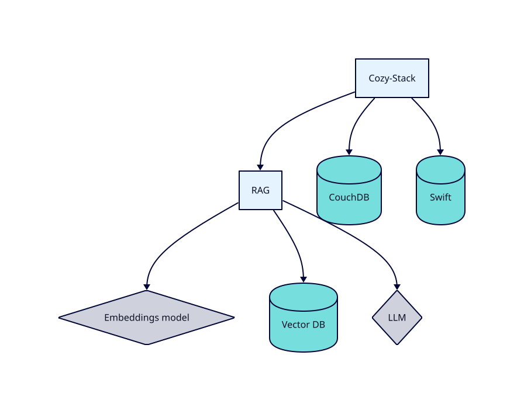

[Table of contents](README.md#table-of-contents)

# AI for personal data

## Introduction

AI can be used for interacting with the personal data of a Cozy. This is
currently an experimental feature. Retrieval-Augmented Generation (RAG) is
a classical pattern in the AI world. Here, it is specific to each Cozy.



## Indexation

First of all, the RAG server must be installed with its dependencies. It is
not mandatory to install them on the same servers as the cozy-stack. And the
URL of RAG must be filled in cozy-stack configuration file (in `rag`).

The indexing follows the assistants: every `io.cozy.ai.chat.assistants`
document whose `knowledgeBase` has an `io.cozy.files` entry defines a folder
to index. The files of that folder (recursively) are sent to the openRAG
server and attached to the workspace named after the folder id; the
assistant's retrieval is scoped to that workspace.

openRAG indexes an upload asynchronously: while the task runs, it still
answers 404 on the file but refuses a second POST with a 409. The worker then
sends the file again with a PUT, which re-indexes the content, instead of
failing on the conflict.

openRAG also deduplicates by content: a partition holds one document per
distinct content, and an upload whose content is already indexed under
another file id is refused with a 409 `DOCUMENT_CONTENT_EXISTS`. The worker
logs that file once (with the id of the document already holding the content)
and skips it for good: it is not indexed, and not attached to any workspace,
so a search hit points at the other copy. A reconcile of its folder does not
change that — the second copy is refused again, and only counted in the
summary of the walk.

The `rag-index` worker does all of this in one job per instance, reading the
changes feed of `io.cozy.files` from a checkpoint. It is woken up by two
`@event` triggers, created by the app in charge of the assistants (the worker
is not reserved, an app token with the `io.cozy.triggers` permission is
enough):

```json
{ "data": { "attributes": {
  "type": "@event", "arguments": "io.cozy.files", "debounce": "30s",
  "worker": "rag-index", "message": { "doctype": "io.cozy.files" } } } }
```

```json
{ "data": { "attributes": {
  "type": "@event", "arguments": "io.cozy.ai.chat.assistants",
  "worker": "rag-index", "message": { "doctype": "io.cozy.files" } } } }
```

The second trigger only wakes the worker when an assistant is created,
modified or deleted: the worker then creates the workspace of a new folder
and pushes a job that walks its subtree (in that order: nothing is indexed
into a workspace that does not exist, and a workspace whose job could not be
pushed is deleted again, so the next run retries both), or removes the
workspace of a folder no assistant uses any more (its files are deleted from
openRAG when no other folder contains them).

A chat on an assistant whose folder has no workspace yet (the job did not run
since the assistant was created) fails with an error event saying the
knowledge base is not indexed; it works once the job ran.

By default, only text-based files are indexed. Images, videos, and audio files
can be indexed by enabling the following feature flags:

- `rag.index.image.enabled`
- `rag.index.video.enabled`
- `rag.index.audio.enabled`

### Operator tools

The admin API exposes them (see [admin.md](admin.md) for the details):

- `POST /instances/:domain/rag/reset` deletes the checkpoint and launches the
  indexing: the whole changes feed is scanned again.
- `POST /instances/:domain/rag/reconcile?dir_id=<id>` re-indexes the subtree
  of one knowledge base folder (without `dir_id`, of all of them).
- `POST /instances/:domain/rag/prune` deletes from openRAG the files no
  knowledge base folder claims and the workspaces of folders no assistant uses.
- `POST /instances/:domain/rag/purge` deletes everything openRAG holds for the
  instance (files, workspaces, partition) and the checkpoint.

A reconcile job skips the files openRAG refuses for good (an unsupported
format, say); a file whose content is missing from the storage is skipped as
well, since it will not come back: each one is logged and the walk goes on,
so only transient errors (network, 5xx) fail the job and have the worker walk
the folder again.
A skipped file stays unindexed until it changes, or until an operator re-walks
its folder with `POST /instances/:domain/rag/reconcile?dir_id=<id>`.

Recovery: an initial indexing that did not finish (the job of a very large
folder, a whole-Drive assistant typically, hit the worker timeout) is
restarted with `POST /instances/:domain/rag/reconcile?dir_id=<id>`; nothing
else replays it, since the files of the folder did not change. Removing a
whole-Drive workspace is also much cheaper with the prune route, which
makes one pass over openRAG's file list, than through the automatic detach of
the workspace diff, which walks the subtree file by file. Note that prune and
purge do not take the lock the indexing jobs use: run them when no rag-index
job is running.

A trigger can still be created by hand with a CLI token:

```sh
$ COZY=cozy.localhost:8080
$ TOKEN=$(cozy-stack instances token-cli $COZY io.cozy.triggers)
$ curl "http://${COZY}/jobs/triggers" -H "Authorization: Bearer $TOKEN" -d '{ "data": { "attributes": { "type": "@event", "arguments": "io.cozy.files", "debounce": "30s", "worker": "rag-index", "message": {"doctype": "io.cozy.files"} } } }'
```

### POST /ai/index/status

The RAG indexer reports the indexation status of a document on this route. The
status is saved on an `io.cozy.ai.chat.rag` document whose identifier is the
identifier of the document it describes. Only files are indexed for now.

This route has no authentication yet.

#### Request

```http
POST /ai/index/status HTTP/1.1
Host: alice.example.net
Content-Type: application/json
```

```json
{
  "partition": "alice.example.net",
  "file_id": "e21dce8058b9013d800a18c04daba326",
  "status": "success",
  "metadata": {
    "doc_rev": "3-6a1b0b8a51a4e0e0a3b7f0f1d2c3b4a5",
    "datetime": "2026-08-20T08:12:00.000Z",
    "created_at": "2026-08-20T08:12:03.512Z",
    "doctype": "io.cozy.files"
  }
}
```

The `status` can be `success`, `error` or `notsupported`. The `doc_rev` is the
revision of the document the status is about, as it was given to the indexer. It
is mandatory: callbacks are ordered on it, and a callback that carries none
cannot be placed. It is saved on the status document as `docRev`, so that a
client can tell whether the current revision of the document is the one
described.

The indexer echoes back more than `doc_rev`, but the other fields are ignored.

#### Response

```http
HTTP/1.1 204 No Content
```

A callback is answered with a `400 Bad Request` when its payload is invalid or
when its partition is not this instance, and with a `500 Internal Server Error`
when the status could not be saved.

A callback about a revision older than the one already saved is accepted but not
saved, and answered with a `204`. One about the same revision describes the same
indexation and is saved.

## openRAG

Some openRAG API are directly exposed through cozy-stack.
Note the JSON-API format is not used here as we follow the openRAG format.

### POST /ai/v1/chat/completions

This route directly follows the [openAI chat completion AI](https://platform.openai.com/docs/api-reference/chat/create).

#### Request

```http
POST /ai/v1/chat/completions HTTP/1.1
Content-Type: application/json
```

```json
{
  "messages": [
    { "role": "user", "content": "Hello there, what's in your mind?" }
  ],
  "temperature": 0.3
}
```

#### Response

```http
HTTP/1.1 200 OK
Content-Type: application/json
```

```json
{
  "id": "chatcmpl-43036e48fbac40fead606e8692a7b408",
  "created": 1763657211,
  "model": null,
  "object": "chat.completion",
  "system_fingerprint": null,
  "choices": [
    {
      "finish_reason": "stop",
      "index": 0,
      "message": {
        "content": "As an artificial intelligence language model, I don't have personal thoughts or emotions like humans do. My purpose is to assist and provide information to the best of my abilities based on the data I have been trained on. Is there something specific you would like to know or discuss?",
        "role": "assistant",
        "tool_calls": null,
        "function_call": null
      }
    }
  ],
  "usage": {
    "completion_tokens": 56,
    "prompt_tokens": 28,
    "total_tokens": 84,
    "completion_tokens_details": null,
    "prompt_tokens_details": null
  },
  "service_tier": null,
  "prompt_logprobs": null,
  "extra": "{\"sources\": []}"
}
```

### POST /ai/v1/tools/execute

This route directly calls the [openRAG](https://github.com/linagora/openrag) tools API.

#### Request

POST /ai/v1/tools/execute HTTP/1.1
Content-Type: multipart/form-data

```
file=<file content>
tool={"name": "extractText"}
metadata={"mime":"application/pdf","name":"myfile.pdf"}
```

#### Response

```http
HTTP/1.1 200 OK
Content-Type: application/json
```

```json
{
  "message": "Some file content"
}
```


## Assistant chat

When a user starts a chat from the assistant, their prompts are sent to the RAG that can use the
vector database to find relevant documents (technically, only some parts of
the documents called chunks). Those documents are added to the prompt, so
that the LLM can use them as a context when answering.

### POST /ai/chat/conversations/:id

This route can be used to ask AI for a chat completion. The id in the path
must be the identifier of a chat conversation. The client can generate a random
identifier for a new chat conversation.

The stack will respond after pushing a job for this task, but without the
response. The client must use the real-time websocket and subscribe to
`io.cozy.ai.chat.events`.

#### Request

```http
POST /ai/chat/conversations/e21dce8058b9013d800a18c04daba326 HTTP/1.1
Content-Type: application/json
```

```json
{
  "q": "Why the sky is blue?",
  "stream": true,
  "websearch": false,
  "assistantID": "abc123",
  "attachmentIDs": ["827f0fbb928b375cc457c732a4013aa7", "9a3b1c2d3e4f5a6b7c8d9e0f1a2b3c4d"]
}
```

- `q` is the user's message (required).
- `stream` enables streaming the response via SSE deltas (defaults to `true`).
- `websearch` enables web search for the query (defaults to `false`).
- `assistantID` (optional) associates the conversation with an `io.cozy.ai.chat.assistants`
  document. When set, the response includes a `relationships` block.
  When the assistant has a knowledge base folder, the retrieval is scoped to
  that folder's workspace. The assistant's folder must have been indexed at
  least once by the `rag-index` worker; otherwise the query fails with an
  error event saying the knowledge base is not indexed.
- `attachmentIDs` (optional) array of ids, specifying which documents should be leveraged by the RAG.
  

#### Response

```http
HTTP/1.1 202 Accepted
Content-Type: application/vnd.api+json
```

```json
{
  "data": {
    "type": "io.cozy.ai.chat.conversations",
    "id": "e21dce8058b9013d800a18c04daba326",
    "rev": "1-23456",
    "attributes": {
      "messages": [
        {
          "id": "eb17c3205bf1013ddea018c04daba326",
          "role": "user",
          "content": "Why the sky is blue?",
          "attachmentIDs": ["827f0fbb928b375cc457c732a4013aa7", "9a3b1c2d3e4f5a6b7c8d9e0f1a2b3c4d"],
          "createdAt": "2024-09-24T13:24:07.576Z"
        }
      ],
      "relationships": {
        "assistant": {
          "data": {
            "id":"b2e1a4144c123ec694697d996102983a",
            "type":"io.cozy.ai.chat.assistants"
          }
        }
      },
      "cozyMetadata": {
        "createdAt": "2024-09-24T13:24:07.576Z",
        "createdOn": "http://cozy.localhost:8080/",
        "doctypeVersion": "1",
        "metadataVersion": 1,
        "updatedAt": "2024-09-24T13:24:07.576Z"
      }
    }
  }
}
```

### Real-time via websockets

#### Messages flow example

```
client > {"method": "AUTH", "payload": "token"}
client > {"method": "SUBSCRIBE",
          "payload": {"type": "io.cozy.ai.chat.events"}}
server > {"event": "CREATED",
          "payload": {"id": "eb17c3205bf1013ddea018c04daba326",
                      "type": "io.cozy.ai.chat.events",
                      "doc": {"object": "delta", "content": "The ", "position": 0}}}
server > {"event": "CREATED",
          "payload": {"id": "eb17c3205bf1013ddea018c04daba326",
                      "type": "io.cozy.ai.chat.events",
                      "doc": {"object": "delta", "content": "sky ", "position": 1}}}
[...]
server > {"event": "CREATED",
          "payload": {"id": "eb17c3205bf1013ddea018c04daba326",
                      "type": "io.cozy.ai.chat.events",
                      "doc": {"object": "sources", "content": [{"id": "827f0fbb928b375cc457c732a4013aa7", "doctype": "io.cozy.files"}]}}}
server > {"event": "CREATED",
          "payload": {"id": "eb17c3205bf1013ddea018c04daba326",
                      "type": "io.cozy.ai.chat.events",
                      "doc": {"object": "done"}}}
```

#### Error message

If an error occurs while processing the AI response (e.g. the LLM is
unavailable), an error event is sent instead:

```
server > {"event": "CREATED",
          "payload": {"id": "eb17c3205bf1013ddea018c04daba326",
                      "type": "io.cozy.ai.chat.events",
                      "doc": {"object": "error", "message": "I don't want to talk today"}}}
```
